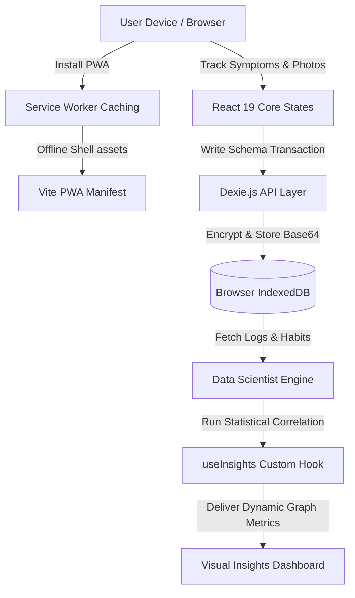

# 🌿 Psoriasis Companion

<p align="center">
  
  
  
  
  
</p>

A privacy-first, offline-capable **Progressive Web App (PWA)** designed to help individuals track chronic psoriasis flare-ups, schedule daily medication routines, log anatomical inflammation spots, and correlate personal lifestyle habits (stress, sleep, diet) with overall skin wellness.

🌐 **[Launch Live Application](https://psoriasis-companion.vercel.app)**

---

## 🔒 Offline-First & Privacy-First Architecture

Health information is highly sensitive. Psoriasis Companion is designed with a **Local-First** design pattern. All data, symptoms logs, medication check-ins, and high-resolution skin photos are stored exclusively inside the browser's sandboxed **IndexedDB** database. No network telemetry or medical trackers are used.



---

## 🚀 Key Features

* **📱 Installable Progressive Web App (PWA):** Installs natively on iOS or Android viewports directly from browser tabs. Caches assets for complete offline capability.
* **🔒 Zero-Server Storage:** Uses Dexie.js (a reactive IndexedDB wrapper) to save full symptom histories and Base64-encoded logs directly onto device hardware.
* **🗺️ Anatomical Silhouette Mapping:** Features an interactive human body vector silhouette, allowing users to map exactly where localized flare-ups are active.
* **📸 Photographic Flare Journals:** Captures high-contrast camera feeds, maps severity ranks (1–10), and logs daily stressors (diet, sleep duration, mood).
* **📊 Correlative Analytics Engine:** The built-in "Data Scientist" analyzer parses local IndexedDB logs to correlate sleep levels and stress ratings with flare-up severities.
* **🌙 Dark Mode Interface:** A high-contrast, accessible dark interface designed to reduce visual strain.

---

## 📁 Repository Directory Structure

```text
├── public/                 # PWA icons, manifest files, and static graphics
├── src/
│   ├── components/
│   │   ├── dashboard/      # Core dashboard modules (MedChecklist, Silhouette BodyMap)
│   │   ├── history/        # Timeline logs, calendars, and past details
│   │   ├── layout/         # Dynamic sidebar navigation and PWA wrapper shell
│   │   ├── log/            # Photo input and symptom evaluation sliders
│   │   ├── settings/       # Routine schedulers and medication setups
│   │   └── trends/         # Analytics charts and custom insight logs
│   ├── db/                 # Dexie.js schema declarations and DB instantiations
│   ├── hooks/              # useInsights correlation hook
│   ├── App.tsx             # Route management and context providers
│   ├── main.tsx            # Main bootstrap entry
│   └── index.css           # Custom CSS variables, themes, and scrollbars
├── index.html              # Core app frame
├── vite.config.ts          # Vite build options & PWA configuration
└── tsconfig.json           # Compiler rules
```

---

## 🛠️ Bootstrapping & Local Development

### ⚙️ System Requirements
* **Node.js:** Version 18.0 or higher
* **Package Manager:** npm or yarn

### 🚀 Setup Steps
1. **Clone the repository:**
   ```bash
   git clone https://github.com/Stormynubee/psoriasis-companion.git
   cd psoriasis-companion
   ```

2. **Acquire & Install node packages:**
   ```bash
   npm install
   ```

3. **Start the local hot-reload server:**
   ```bash
   npm run dev
   ```

4. **Access the local sandbox:**
   Open browser target: `http://localhost:5173`.

---

## 🤝 Open-Source Contribution Guide

Contributions are highly valued. To add features or submit UI adjustments:

1. **Fork** the Repository.
2. Initialize a branch: `git checkout -b feature/AmazingFeature`.
3. Stage and commit: `git commit -m "feat: add beautiful correlation metric"`.
4. Push code: `git push origin feature/AmazingFeature`.
5. Open a **Pull Request**.

---

## 📝 License

Distributed under the MIT License. See `LICENSE` for more information.

---
*Designed with care for the chronic illness and neurodivergent community by Stormynubee.*
