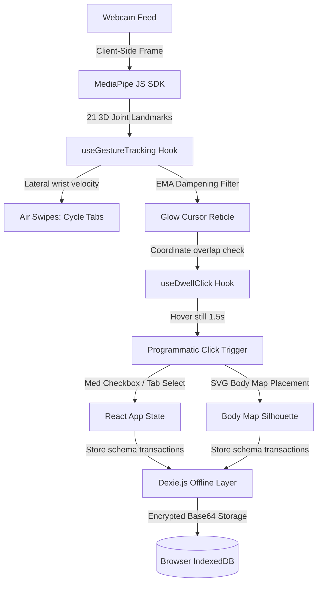

# 🌿🖐️ Psoriasis Companion (with Aether Touchless Control)

<p align="center">
  
  
  
  
  
  
</p>

A privacy-first, offline-capable **Progressive Web App (PWA)** built to help individuals track chronic psoriasis flare-ups, schedule medication routines, and analyze wellness correlations—now integrated with the **Aether Hands v2.0** computer vision engine.

Featuring completely **touchless gestural control**, this application solves the daily physical strain faced by individuals with severe joint pain, psoriatic arthritis, dactylitis ("sausage fingers"), or painful cracking skin on their palms and fingers by allowing them to navigate and log symptoms entirely in mid-air.

🌐 **[Launch Live Application](https://psoriasis-companion.vercel.app)**

---

## 🩺 The Accessibility Breakthrough

Standard digital inputs (tapping hard glass touchscreens, clicking mouse keys, or keyboard typing) require high physical pressure and fine-motor finger movement. For someone with severe palm plaques or inflamed joints, this interaction is exhausting, splits bleeding skin, and worsens symptoms.

**Psoriasis Companion with Aether Control** shifts input from the tactile realm to the optical realm:
* **Zero Skin Contact:** Camera tracking replaces glass tapping.
* **No Joint Squeezing:** Eliminates painful physical pinch movements.
* **EMA Smoothing Filter:** Dampens high-frequency webcam hand jitter to create a smooth, high-precision cursor overlay.

---

## 🔒 Offline-First, Privacy-First Architecture

Health data is highly sensitive. This app operates under a **Local-First** model. All camera frames captured during gestural tracking are processed purely in local browser memory client-side using MediaPipe's Web SDK. No video feed, coordinates, symptom logs, or skin photos are ever uploaded to a server or third-party service.



---

## 🖐️ Touchless Gestural Matrix

When **Touchless Gesture Mode** is activated under settings, the user controls a floating glowing cursor via natural, mid-air movements.

| Gesture | Action Target | Visual Indicator | Accessibility Benefit |
| :--- | :--- | :--- | :--- |
| **Hover Pointer** | Moves the floating neon-cyan cursor | Glowing reticle following index tip | Requires no screen contact or physical pressure |
| **Dwell (Hover 1.5s)** | Triggers left click on buttons/inputs | Neon-magenta circular stroke ring loading | Eliminates the need to physically pinch or tap |
| **Air Swipe Left** | Switches to next panel (right) | HUD feedback label | Zero fine-motor finger motion required |
| **Air Swipe Right** | Switches to previous panel (left) | HUD feedback label | Zero fine-motor finger motion required |
| **Body Map Hover** | Selects anatomical flare-up spots | Glowing red dot indicator | Mark inflammation maps touchlessly |

---

## 🚀 Key Features

* **📱 Installable Progressive Web App (PWA):** Installs natively on iOS or Android directly from the browser, offering offline capabilities.
* **🔒 Zero-Server Storage:** All symptom timeline histories, logs, and photos reside securely on device hardware via Dexie.js (IndexedDB wrapper).
* **🗺️ Touchless Body Silhouette Mapping:** Features a minimalist vector silhouette where users hover their hand in mid-air to map active flare-up regions.
* **⚙️ Custom Accessibility Sliders:** Directly adjust the **Cursor Smoothing weight (EMA Alpha)** and **Dwell Delay Speed** from the settings panel.
* **📊 Correlative Analytics Engine:** Compares symptom logs with lifestyle metrics (stress, sleep) to provide personalized skin wellness insights.
* **🌙 Cyber-HUD Dashboard:** A semi-transparent glassmorphic edge menu displaying active webcam channels, FPS rates, and tracking quality indicators.

---

## 📁 Repository Directory Structure

```text
├── public/                 # PWA icons, manifest files, and static graphics
├── src/
│   ├── components/
│   │   ├── dashboard/      # MedChecklist, Silhouette BodyMap
│   │   ├── history/        # Timeline logs, calendars, and past details
│   │   ├── layout/         # Navigation and PWA wrapper shell
│   │   ├── log/            # Photo input and symptom evaluation sliders
│   │   ├── settings/       # Medication schedulers and Gesture preferences
│   │   └── trends/         # Analytics charts and custom insight logs
│   ├── db/                 # Dexie.js schema declarations and DB instantiations
│   ├── hooks/
│   │   ├── useGestureTracking.ts  # MediaPipe setup, EMA filter, swipe velocity
│   │   ├── useDwellClick.ts       # Coordinate overlap scanner & dwell timer clock
│   │   └── useInsights.ts         # Lifestyle symptoms correlation analyzer
│   ├── App.tsx             # Shell layout mounting, custom reticles & Edge HUD
│   ├── main.tsx            # Main bootstrap entry
│   └── index.css           # Custom CSS variables, neon cursor, HUD panels
```

---

## 🛠️ Bootstrapping & Local Development

### ⚙️ System Requirements
* **Node.js:** Version 18.0 or higher
* **Package Manager:** npm

### 🚀 Setup Steps
1. **Clone the repository:**
   ```bash
   git clone https://github.com/Stormynubee/psoriasis-companion.git
   cd psoriasis-companion
   ```

2. **Install node packages:**
   ```bash
   npm install
   ```

3. **Start the local hot-reload dev server:**
   ```bash
   npm run dev
   ```
   Open browser target: `http://localhost:5173`.

4. **Verify the TDD Hook Test Suite:**
   Run our comprehensive Vitest unit tests confirming the dwell-click timer accuracy:
   ```bash
   npm run test
   ```

---

## 📝 License

Distributed under the MIT License. See `LICENSE` for more information.

---
*Designed with care for the chronic illness, disabled, and neurodivergent community by Stormynubee | Digital Reality Architect.*
